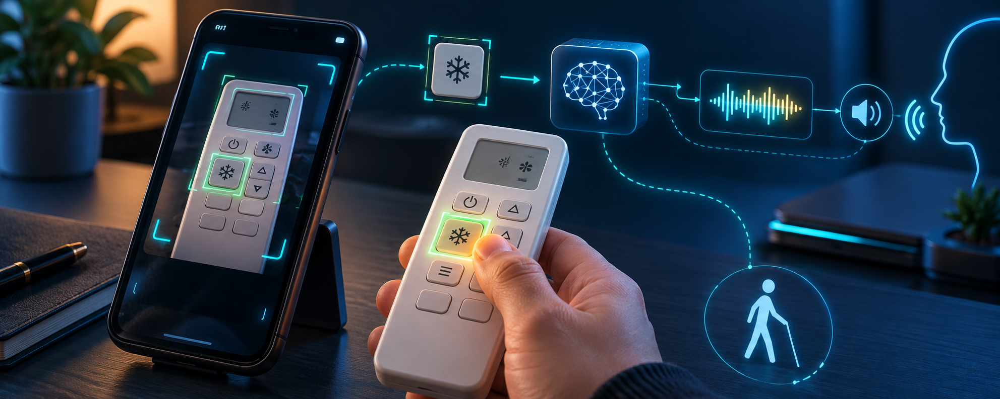
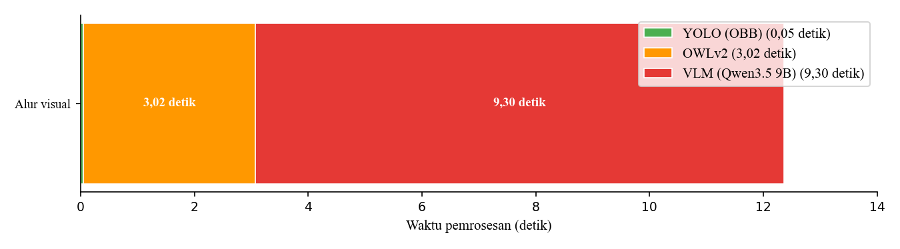
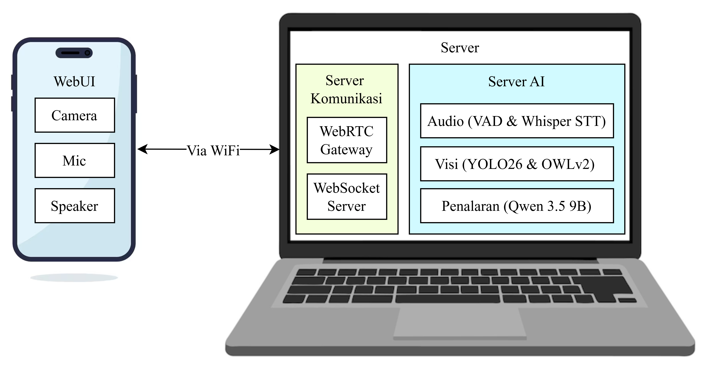
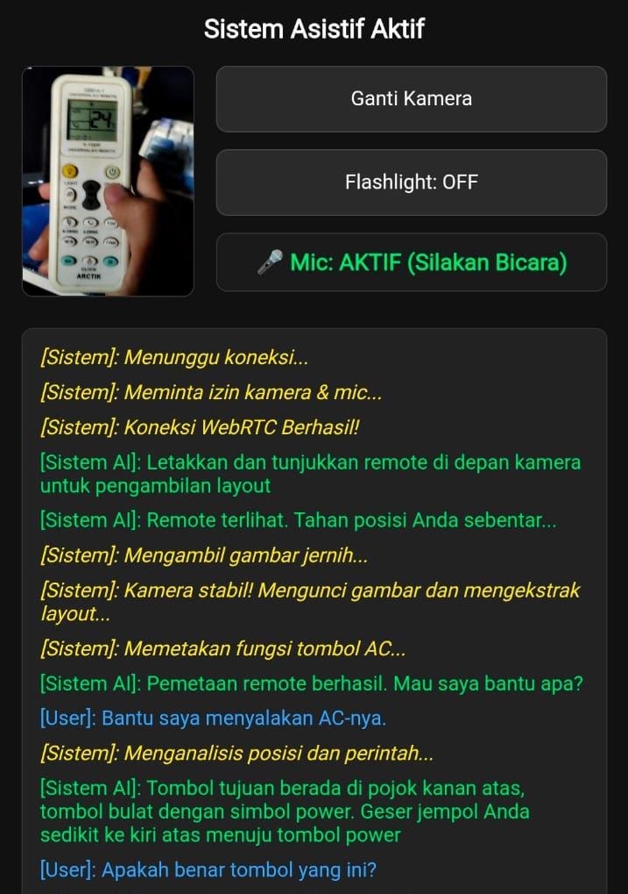
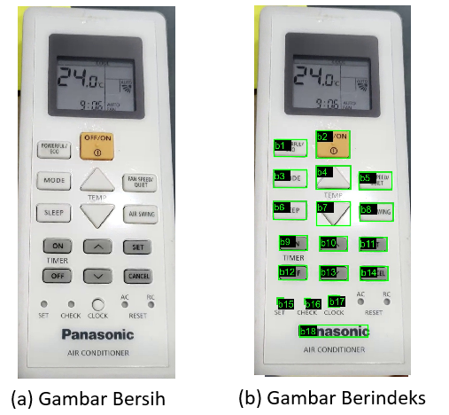

# Adaptive Voice Guidance for Unfamiliar AC Remotes

<p align="center">
  
</p>

<p align="center">
  <strong>Sistem AI multimodal lokal yang membantu pengguna tunanetra menemukan dan mengoperasikan tombol pada remote AC yang belum dikenal.</strong>
</p>

<p align="center">
  <a href="#hasil-terukur">Hasil</a> ·
  <a href="#cara-kerja">Cara Kerja</a> ·
  <a href="#kontribusi-dan-skill-yang-diterapkan">Kontribusi</a> ·
  <a href="#menjalankan-proyek">Menjalankan Proyek</a> ·
  <a href="docs/ARSITEKTUR_SISTEM.md">Dokumentasi Teknis</a>
</p>

<p align="center">
  
  
  
  
  
</p>

## Tentang proyek

Tombol remote AC umumnya tidak memiliki penanda taktil dan susunannya berbeda antarmerek. Proyek tugas akhir ini mengubah smartphone menjadi antarmuka asistif: kamera mengenali remote dan posisi ibu jari, mikrofon menerima perintah, lalu sistem memberi instruksi suara adaptif hingga pengguna mencapai tombol yang dituju.

Saya merancang dan mengimplementasikan pipeline lengkapnya, mulai dari komunikasi real-time smartphone–PC, deteksi objek berorientasi, ekstraksi tombol secara zero-shot, pemetaan fungsi dengan Vision-Language Model (VLM), transkripsi suara, hingga mekanisme *background monitoring* yang mengonfirmasi target secara otomatis. Seluruh inferensi utama berjalan di PC lokal sehingga data kamera dan percakapan tidak perlu dikirim ke layanan AI cloud.

> **Tugas akhir:** *Pengembangan Sistem Instruksi Suara Adaptif Berbasis LLM-Vision Reasoning untuk Membantu Tunanetra Mengoperasikan Remote AC yang Belum Dikenal* - **M. Andi Abdillah**, Teknik Elektro, Institut Teknologi Sepuluh Nopember.

## Hasil terukur

| Area | Hasil | Apa yang diukur |
|---|---:|---|
| Deteksi remote & ibu jari | **0,995 mAP@0.5** | YOLO26n OBB pada data validasi |
| Ekstraksi tombol zero-shot | **722 kandidat / 50 remote** | OWLv2, rata-rata **3,02 detik** |
| Tugas operasional VLM | **93,2% akurasi** | Qwen3.5 9B INT4, penggunaan VRAM **6,7 GB** |
| Transkripsi suara | **2,33% WER** | Kondisi sunyi; **13,44%** pada kondisi bising |
| Inferensi STT | **485 ms** | Faster Whisper |
| Komunikasi real-time | **0,09% packet loss audio** | Streaming WebRTC |
| Sinyal kontrol | **5,87 ms/perintah** | WebSocket |
| Evaluasi formatif | **81,1% task completion rate** | 8 partisipan dengan penutup mata; TCT rata-rata **15,9 detik** |

Angka di atas berasal dari pengujian tugas akhir. Evaluasi dengan tiga partisipan tunanetra menunjukkan seluruh 12 tugas yang dicoba akhirnya dapat diselesaikan pada konfigurasi kamera statis, tetapi beberapa percobaan masih memerlukan pengulangan dan bantuan peneliti. Hasil tersebut menunjukkan kelayakan awal, bukan kesimpulan final mengenai pengalaman pengguna pada populasi yang lebih luas.

<p align="center">
  
  <br>
  <sub>Rincian latensi pipeline visual VLM pada skenario penalaran.</sub>
</p>

## Cara kerja

1. Smartphone mengirim video dan audio ke PC melalui WebRTC.
2. YOLO OBB mendeteksi remote, memperbaiki orientasi citra, dan melacak posisi ibu jari.
3. OWLv2 mengekstrak kandidat tombol tanpa model khusus untuk setiap merek remote.
4. Qwen3.5 9B memetakan indeks tombol ke fungsi visual dan memahami perintah pengguna.
5. Faster Whisper mentranskripsikan perintah *hold-to-speak*.
6. Sistem memberi arah melalui TTS; monitor latar belakang memeriksa posisi jempol setiap 500 ms dan mengonfirmasi saat target tercapai.

<p align="center">
  
  <br>
  <sub>Arsitektur client–server: smartphone sebagai sensor dan antarmuka, PC sebagai server komunikasi dan AI.</sub>
</p>

## Dari citra menjadi panduan suara

<table>
  <tr>
    <td width="50%" align="center">
      <br>
      <sub><strong>Antarmuka aksesibel</strong><br>Kamera, hold-to-speak, kontrol senter, haptic feedback, dan riwayat instruksi.</sub>
    </td>
    <td width="50%" align="center">
      <br>
      <sub><strong>Representasi spasial</strong><br>Remote dinormalisasi, tombol dideteksi, lalu setiap kandidat diberi indeks untuk dipetakan oleh VLM.</sub>
    </td>
  </tr>
</table>

Contoh interaksi:

```text
Pengguna : "Bantu saya menyalakan AC."
Sistem   : "Tombol power berada di kanan atas. Geser jempol sedikit ke kiri atas."
Monitor  : mendeteksi jempol mencapai target
Sistem   : "Nah, itu tombolnya. Silakan tekan."
```

## Kontribusi dan skill yang diterapkan

| Kompetensi | Implementasi dalam proyek |
|---|---|
| **Computer Vision** | Membuat dataset kustom, melatih YOLO OBB untuk remote dan ibu jari, koreksi orientasi, stabilisasi frame, serta ekstraksi tombol zero-shot dengan OWLv2. |
| **Vision-Language Model** | Merancang prompt terstruktur, representasi tombol berindeks, pemetaan fungsi tombol, klasifikasi intent, dan reasoning navigasi spasial. |
| **Speech AI** | Mengintegrasikan Faster Whisper, VAD, filter derau/halusinasi, TTS ganda, serta cache audio. |
| **Real-time Systems** | Membangun streaming WebRTC, kanal kontrol WebSocket, server async `aiohttp`, thread pool, locking, dan monitor tugas paralel. |
| **Accessible Interaction** | Mendesain hold-to-speak, instruksi arah singkat, getaran, bunyi bip, kontrol senter, auto-mute, dan auto-confirm. |
| **Edge AI & Optimization** | Menjalankan model lokal, memakai quantization INT4, lazy loading singleton, jalur rule-based <1 ms, dan pengelolaan VRAM. |
| **Research & Evaluation** | Menyusun metrik model, pengujian jaringan dan latensi, evaluasi tugas pengguna, logging CSV, serta analisis keterbatasan. |
| **Software Engineering** | Memisahkan sistem menjadi modul vision, audio, transport, reasoning, cache, UI, dan observability dengan konfigurasi berbasis environment variable. |

## Keputusan teknis utama

- **YOLO OBB:** orientasi remote ikut diprediksi sehingga citra dapat diluruskan sebelum tombol dianalisis.
- **OWLv2 + VLM:** sistem dapat menghadapi tata letak remote baru tanpa melatih pendeteksi tombol per merek.
- **Hybrid rule-based/VLM:** perintah deterministik diproses kurang dari 1 ms, sedangkan VLM dipakai ketika konteks visual atau penalaran diperlukan.
- **WebRTC + WebSocket:** media tetap real-time, sedangkan event UI, TTS, dan status sistem memakai kanal kontrol terpisah.
- **Local-first inference:** kamera, suara, dan model diproses pada jaringan lokal melalui PC pengguna.

Dokumentasi alasan desain lainnya tersedia di [Architecture Decision Records](docs/ADRs.md).

## Evaluasi bersama pengguna

Pengujian dilakukan bertahap: verifikasi teknis per subsistem, evaluasi formatif dengan delapan partisipan berpenutup mata, lalu evaluasi eksploratif bersama tiga partisipan tunanetra. Proses ini menghasilkan temuan desain penting, terutama kebutuhan kamera statis, instruksi yang lebih ringkas, dan penanganan pertanyaan relasi spasial yang lebih kuat.

## Arsitektur kode

```text
src/
├── server_vision.py       # WebRTC, HTTP API, WebSocket, distribusi TTS
├── audio_inference.py     # Hold-to-speak, VAD, Faster Whisper
├── vision_reasoning.py    # Layout, VLM reasoning, navigasi, auto-confirm
├── rotate_remote.py       # Deteksi OBB, rotasi, dan crop remote
├── vision_models.py       # Lazy-loading YOLO dan OWLv2
├── vision_http.py         # HTTP utilities dan thread pool
├── tts_cache.py           # Cache audio thread-safe
├── log_daemon.py          # Telemetri percakapan, event, dan resource
├── hybrid_inference.py    # Mode pengujian melalui terminal
└── index.html             # Web UI smartphone
```

Dokumentasi lanjutan:

- [Arsitektur sistem](docs/ARSITEKTUR_SISTEM.md)
- [Referensi API](docs/API.md)
- [Panduan deployment](docs/DEPLOYMENT.md)
- [Panduan pengembangan](docs/DEVELOPMENT.md)
- [Panduan pengguna](docs/USER_GUIDE.md)
- [Architecture Decision Records](docs/ADRs.md)

## Menjalankan proyek

### Persyaratan

- Python 3.10–3.12
- Smartphone dengan browser modern dan PC pada jaringan Wi-Fi/LAN yang sama
- LM Studio dengan model vision yang menyediakan API OpenAI-compatible pada port `1234`
- GPU NVIDIA direkomendasikan; konfigurasi penelitian memakai CUDA 12.x

### Instalasi

```bash
git clone https://github.com/AndiArvy/asistif-code.git
cd asistif-code
python -m venv venv
```

Aktifkan virtual environment:

```bash
# Windows
venv\Scripts\activate

# Linux/macOS
source venv/bin/activate
```

Instal dependensi:

```bash
python -m pip install --upgrade pip
pip install -r requirements.txt
```

`requirements.txt` memakai wheel PyTorch CUDA 12.6. Petunjuk untuk CUDA lain dan CPU-only tersedia sebagai komentar di dalam file tersebut.

### Menjalankan sistem

Buka dua terminal setelah API LM Studio aktif:

```bash
# Terminal 1 - server media dan komunikasi
python src/server_vision.py

# Terminal 2 - transkripsi dan reasoning
python src/audio_inference.py
```

Kemudian buka `http://<IP_PC>:8080` pada smartphone dan izinkan akses kamera serta mikrofon.

Untuk merekam data evaluasi atau menjalankan mode terminal:

```bash
# Opsional: observability dan log CSV
python src/log_daemon.py

# Alternatif: pengujian tanpa smartphone
python src/hybrid_inference.py
```

Konfigurasi lengkap, kebutuhan VRAM, dan troubleshooting tersedia di [panduan deployment](docs/DEPLOYMENT.md).

> **Keamanan jaringan:** server tidak menyediakan autentikasi dan ditujukan hanya untuk jaringan lokal tepercaya. Jangan meneruskan port `8080` ke internet. Lihat [kebijakan keamanan](SECURITY.md) sebelum deployment.

## Status dan batasan

Proyek ini merupakan prototipe riset. Performa dipengaruhi pencahayaan, kestabilan kamera, kemiripan ikon, dan posisi tangan. Dataset pengguna masih terbatas, sehingga hasil evaluasi perlu dilanjutkan dengan lebih banyak partisipan tunanetra dan penggunaan longitudinal sebelum sistem digunakan sebagai produk asistif sehari-hari.

## Tentang pengembang

Saya **M. Andi Abdillah**, mahasiswa Teknik Elektro ITS dengan minat pada robotics, artificial intelligence, computer vision, dan intelligent systems. Selain proyek ini, saya pernah menjadi bagian dari tim autonomous surface vessel Barunastra ITS dan mewakili ITS pada kompetisi RoboBoat 2024 dan 2025 di Amerika Serikat.

[GitHub](https://github.com/AndiArvy) · [Dokumentasi teknis proyek](docs/ARSITEKTUR_SISTEM.md)

## Lisensi

Kode dan model kustom dirilis di bawah [MIT License](LICENSE). Status aset dan komponen pihak ketiga dijelaskan dalam [pemberitahuan aset dan model](ASSET_AND_MODEL_NOTICES.md) serta [model card](MODEL_CARD.md).
